# cli_calendar_app
<p float="left">
    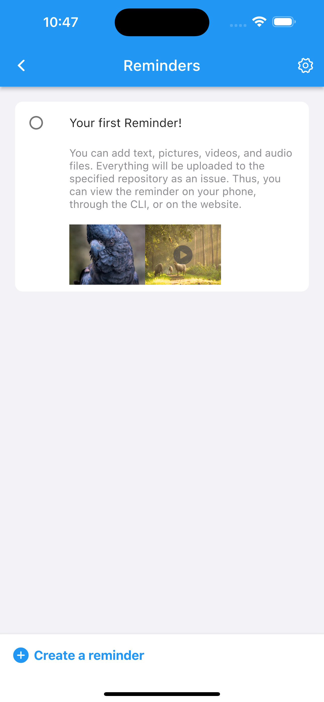
    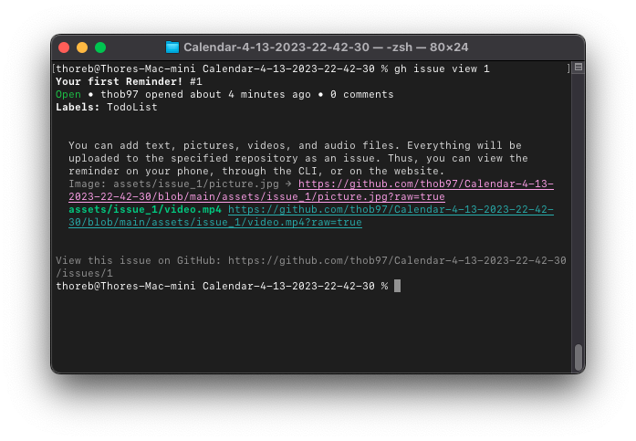
    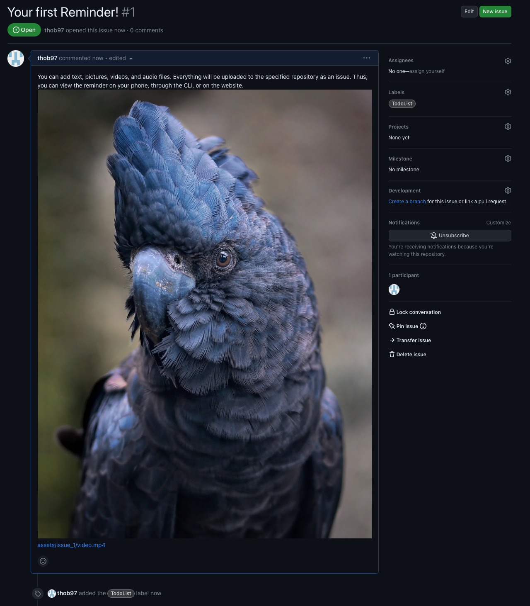
</p>

The project focuses on attempting to develop a suitable app for CLI calendars. CLI calendars are calendars that operate solely through a command-line interface, without a graphical user interface. Therefore, creating an app for CLI calendars requires special consideration. A straightforward porting of such an application to mobile devices would be less practical, as the small display and limited keyboard would make navigation challenging. Hence, I endeavored to develop an appropriate app by leveraging the strengths of both mobile and PC platforms during the development process. If you are interested, you can read my [bachelor thesis](https://github.com/thob97/bachelor-thesis_CLI-calendar-app.git), available only in German.

## Table Of Content

- [Usage](#usage)
- [Functions](#functions)
- [Supported CLI calendar](#supported-cli-calendar)
- [Testet with version](#testet-with-version)
- [Run](#run)
- [Tests](#tests)
- [Example pictures](#example-pictures)
- [Used architecture](#used-architecture)
- [Used design patterns](#used-design-patterns)

## Usage
The app is ment to be used as follows: 
1. Use the CLI program as you normally would, such as creating appointments. 
1.2 Afterward, push the CLI calendar file to the GitHub repository. 
2. The app will display the appointments and provide reminders before they occur, making it useful when you are away from your PC. 
3. "To-dos" can be created on the phone as pictures, audio, videos, or text. These "to-dos" serve as reminders for new appointments you may want to create. For example, if you're on the go and just made an appointment for the barber and you are unable to use your pc, you can instead create a "to-do" entry for it on your phone.
4. Once you are on your PC, you can view these "to-dos" using the phone, website, or CLI interface and complete them with your preferred CLI calendar.
4.1 On GitHub, these "to-dos" will be displayed as issues, allowing them to be viewed and configured via the GitHub website.
4.2 Using the [GitHub CLI](https://cli.github.com) application (e.g., `gh issue list` and `gh issue view <num>`), the "to-dos" can be displayed in the CLI.
4.3 On the phone, simply use the appropriate app.


## Functions
 - Utilizes GitHub as the backend.
    - Utilizes GitHub's issues and file storage functionalities.
 - Graphical calendar for appointments created by CLI calendars.
    - Supports a month view to display appointments.
    - Supports a day view to display appointments.
 - Creation of reminders.
    - Through: text,
    - photos,
    - audio,
    - and video
 - Automatic notifications for upcoming appointments.  
 - Configuration on the PC: (modify various app settings on the pc)
    - For example, adjusting the notification time
    - Setting the maximum number of displayed "to-dos."
    - and more
 - Automatic configuration on the phone 
    - Creates a repository on GitHub
    - Generates the configuration file 
    - Configures the settings on the phone
    - Creates sample "to-dos" and appointments to test the app

## Supported CLI calendar
 - currently only [when](https://www.lightandmatter.com/when/when.html) is supported, but more could be added

## Testet with version
 - macOS Ventura: 13.2.1
 - android studio: 2022.1.1 
 - Flutter: 3.7.3
 - IPhone 14 iOS: 16.2, iPhone SE1 iOS: 15.7.3
 - When CLI calendar: 1.1.45
 - Xcode 14.2
 - Android SDK Platform-Tools: 34.0.0
 - DevTools: 2.20.1
 - Dart 2.19.2

## Run
```
flutter pub get
flutter run
```

## Tests
Various module regression tests have been implemented for:
 - CalendarParser (parsing events and appointments)
 - DatabaseConnection (connecting to GitHub)
These tests serve to ensure the functionality and reliability of the respective modules. They are particularly helpful if you decide to contribute to or fork this project, as they provide a solid foundation for further development and maintenance.

## Example pictures
<p float="left">
    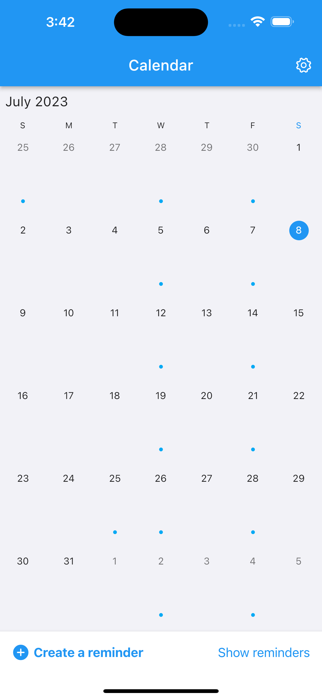
    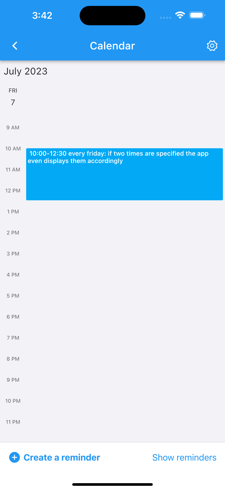
    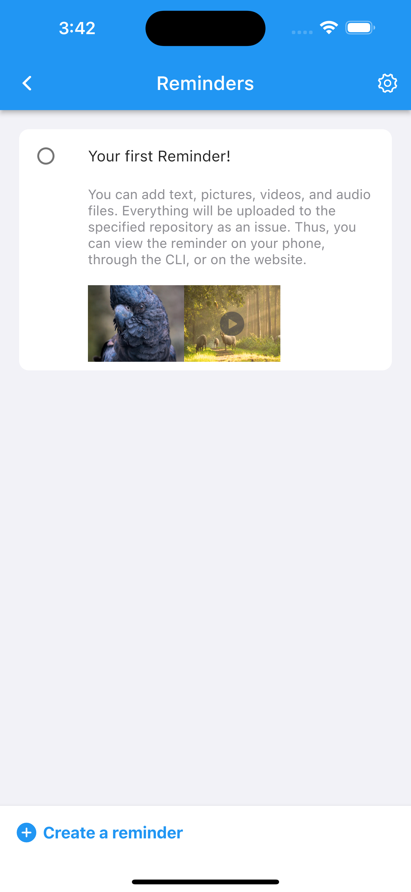
    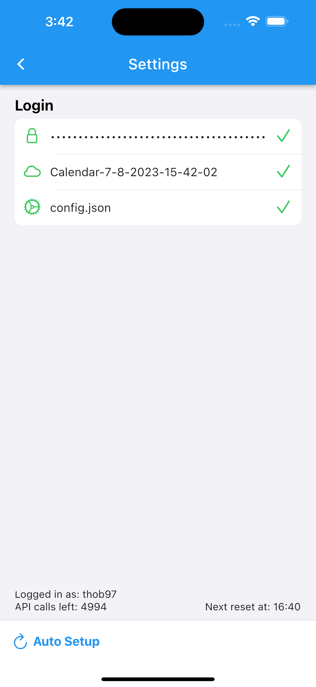
    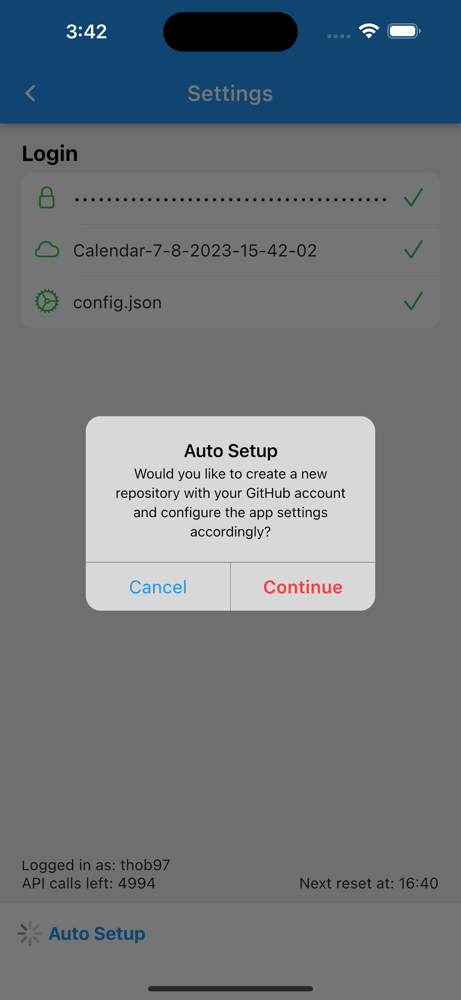
    
    
</p>


## Used architecture
###### (ablagebasiert)
<p float="left">
    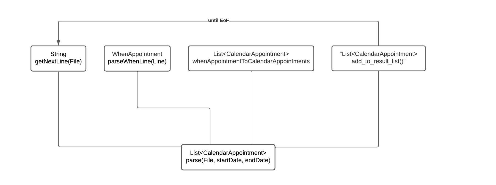
    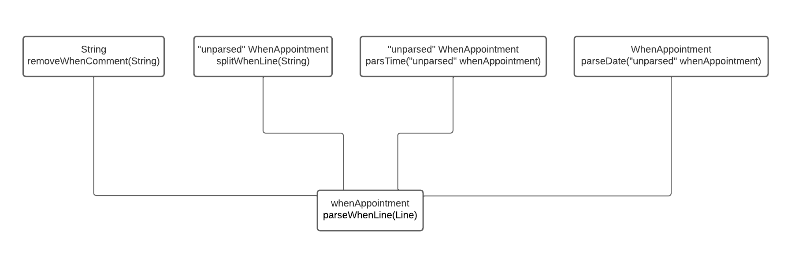
</p>

## Used design patterns
###### (singelton, fassade, proxy, 2x strategie)
<p float="left">
    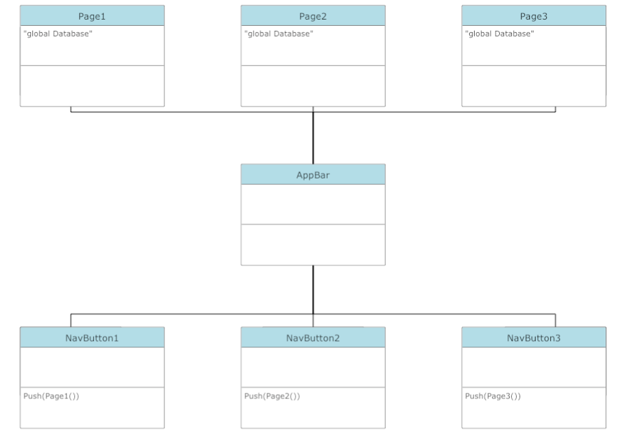
    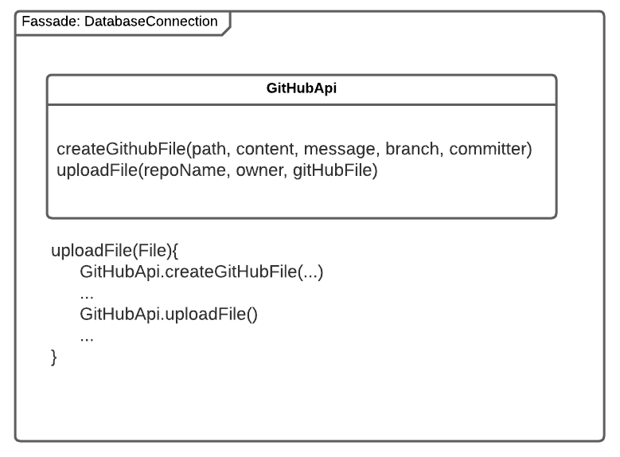
    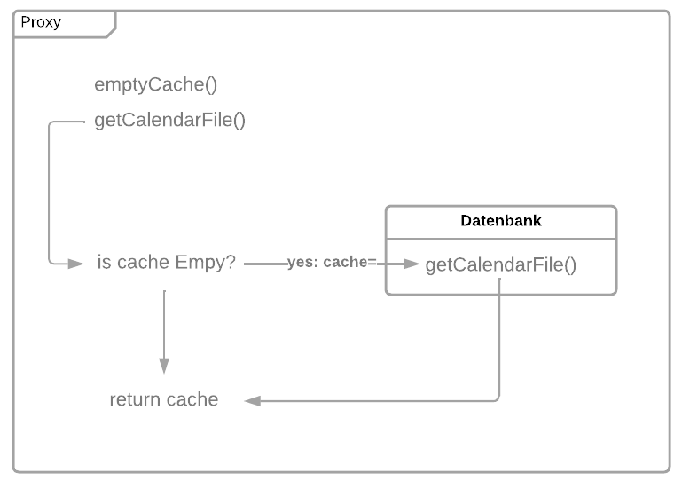
    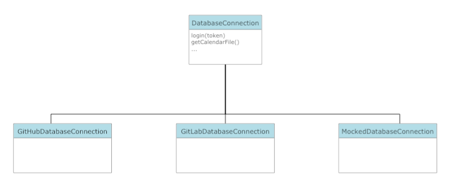
    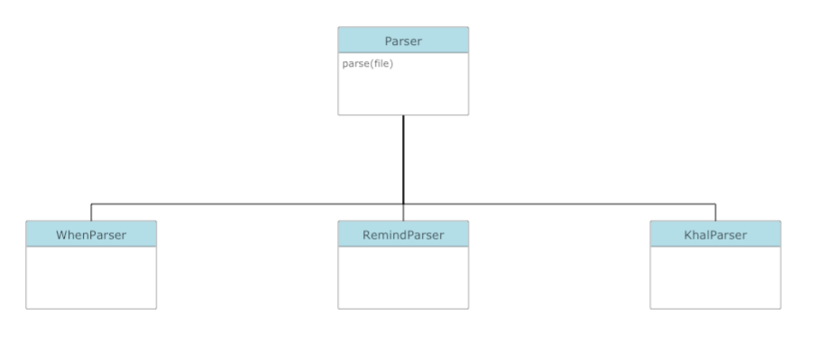
</p>
